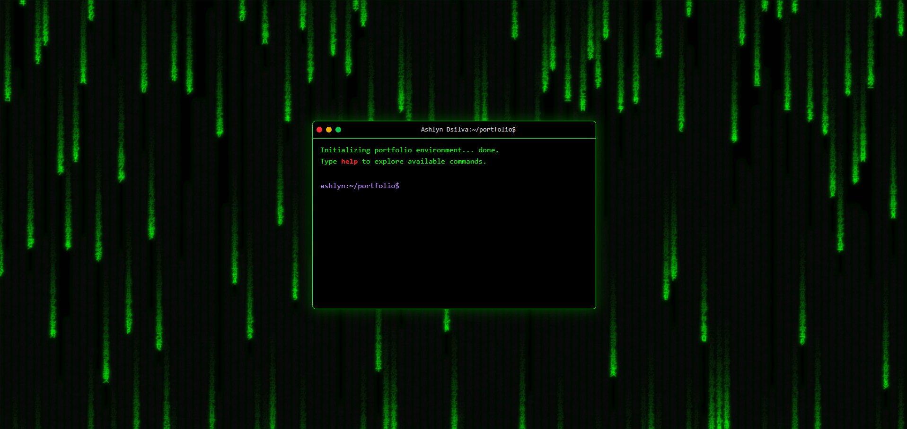
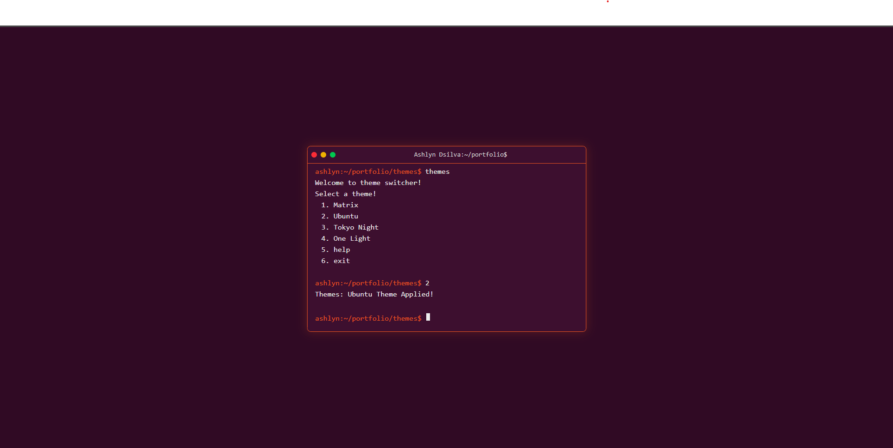
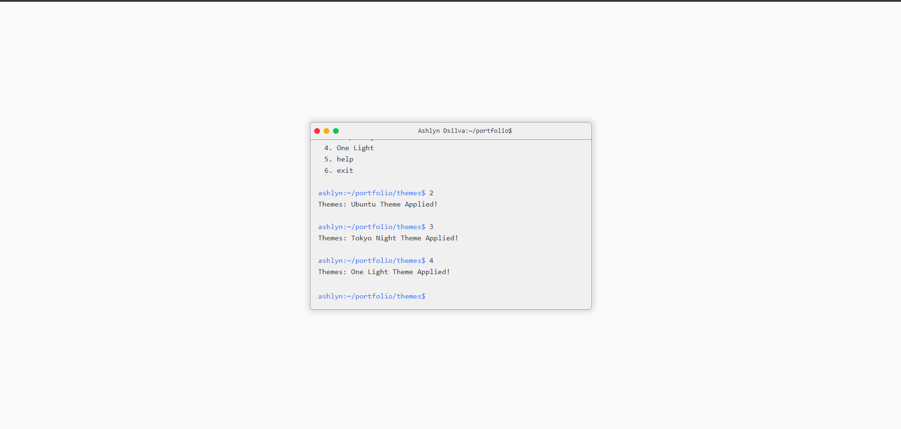
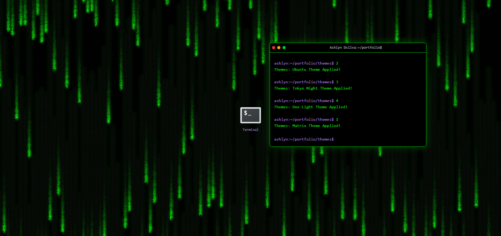
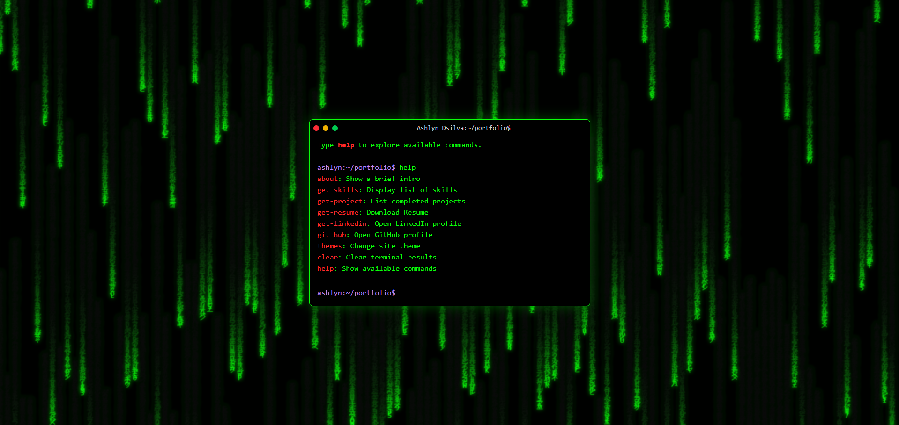

# portfolio-os

A simple Linux terminal–style personal portfolio built using **Next.js** and **Tailwind CSS**.

### Screenshots

### Matrix


### Ubuntu  


### Tokyo Night


### One Light


### Draggable terminal and icon


### Help Menu


## Getting Started

### 1. Clone the repository
```bash
git clone https://github.com/AshDs25/portfolio-os.git
cd portfolio-os
```

### 2. Install dependencies
Using **yarn** (recommended):
```bash
yarn install
```

Or with **npm**:
```bash
npm install
```

### 3. Run the development server
```bash
yarn dev
```
or
```bash
npm run dev
```

The app will be available at [http://localhost:3000](http://localhost:3000).

### 4. Build for production
```bash
yarn build
yarn start
```
or
```bash
npm run build
npm start
```

## Tech Stack
- **Next.js** – Framework for server-side rendering and static site generation  
- **Tailwind CSS** – Utility-first CSS framework for styling  
- **React** – UI component library  
